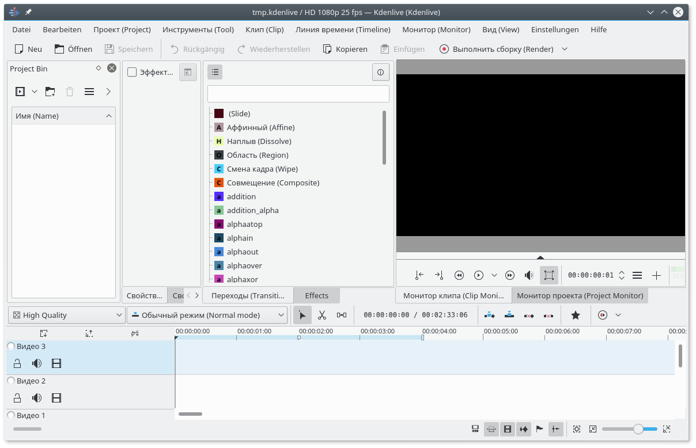

# l10n-bilingual
This project will let you use bilingual interface in your desktop applications (kdenlive).
First language will be your native and second will be english.

This may be helpful when making tutorial videos on your native language, while providing non-your language viewers ability to understand what you are doing.
Also it it usefull when you are watching english tutorials, but at the same time you want to know how things are called in your native language.


## This repository contains

* bilingwise - script, which converts single language po file to bilingual po file
* sample-for-tests.po - file for testing how bilingwise processes different cases
* README.md - this readme
* PKGBUILD - makepkg script for building additional localization package for ArchLinux

# Usage:

## Making bilingual localization package:
* Make empty directory
* Download PKGBUILD to that directory
* Cd to that directory and edit PKGBUILD
 * You want to set ```bilingwise_lang``` variable to your native language code
 * Optionally, you may want to change ```replace_lang``` language code, which will be filled by your bilingual localization. It may be useful if you want install several bilingual packages. Set some exotic language code here, but which is standard for qt (for example, ts or zu).
* Run makepkg and install new package.
* Start kdenlive, go to Help -> Switch Application Language and choose exotic language, that you set in ```replace_lang```.
* Restart kdenlive and enjoy bilingual interface


## Using bilingwise script manually:
* Download bilingwise script from this repository
* Download localization files for your language. For example, for kde it resides in
  "https://download.kde.org/stable/applications/$pkgver/src/$pkgbase/$pkgbase-$_locale-$pkgver.tar.xz"
  (replace variables with needed versions)
* Locate file you want to translate (for example, kde-l10n-ru-16.12.3/5/ru/messages/kdemultimedia/kdenlive.po)
* Run in terminal:
    `$ ./$path_to_script/bilingwise $path_to_po/kdenlive.po`
  (replace variables with your pathes)
  It will generate kdenlive.po.ru-with-en.po
* Replace original kdenlive.po with new one (rename kdenlive.po.ru-with-en.po to kdenlive.po)
* Rebuild your kde-l10n package (for ArchLinux users: https://www.archlinux.org/packages/extra/any/kde-l10n-ru/)
* Install built package
* Start kdenlive and enjoy bilingual interface

# Here is example of how it looks:


# TODO:
- [ ] Make case 9 to work properly
- [ ] Remove additional unwanted new lines after quote_respecting_echo function
- [ ] Make qt to understand custom locales (i.e. ru-bilingual). Now we are replacing exotic locale (i.e. ts or zu).
- [ ] Make translation other than generic strings (like File, Edit, etc...) to contain ampersands (see case 12 in sample-for-tests.po).
- [ ] Make script to automatize all remaining po file to bilingwise automatically (so, we could bilingwise all applications)
